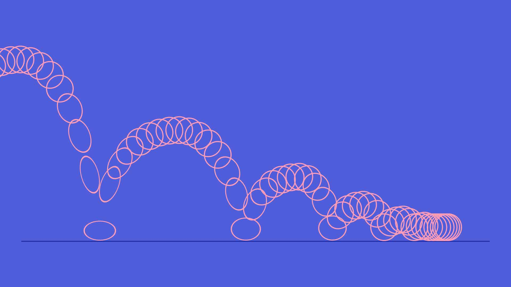
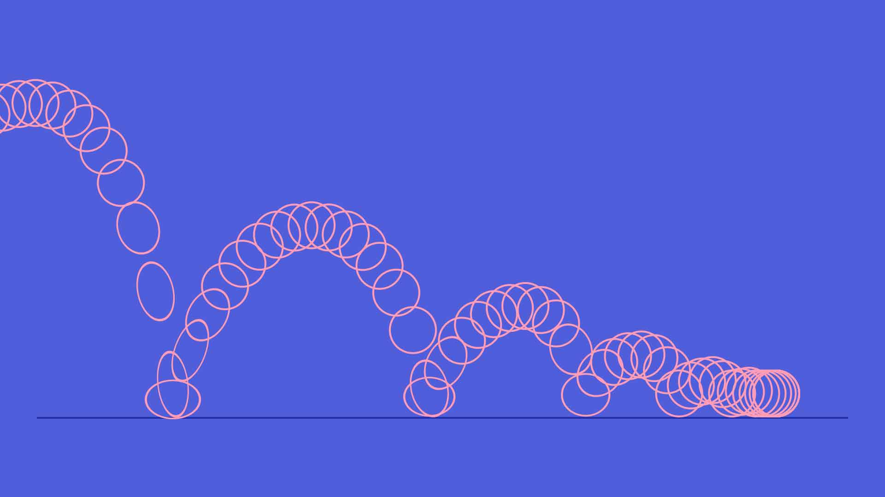
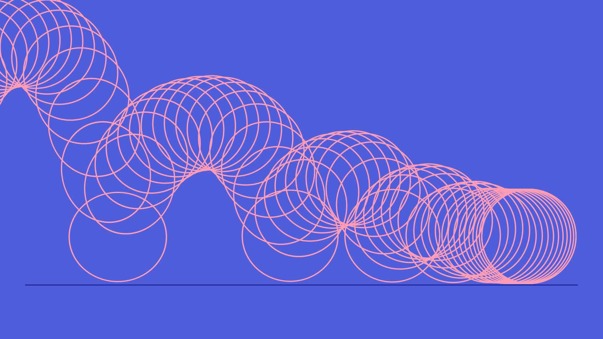
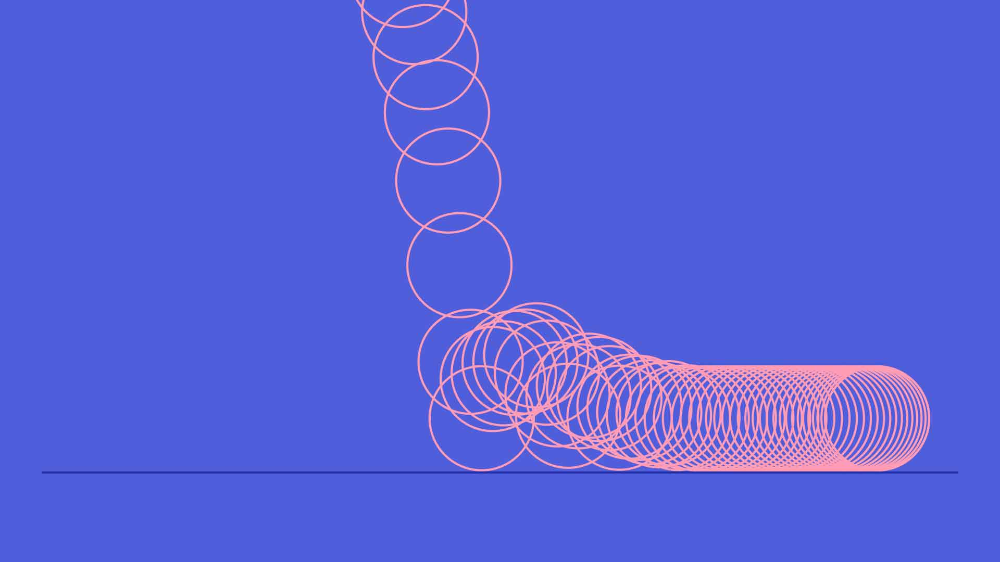
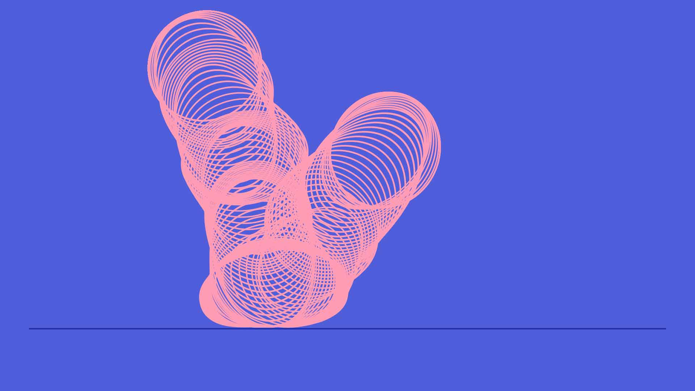
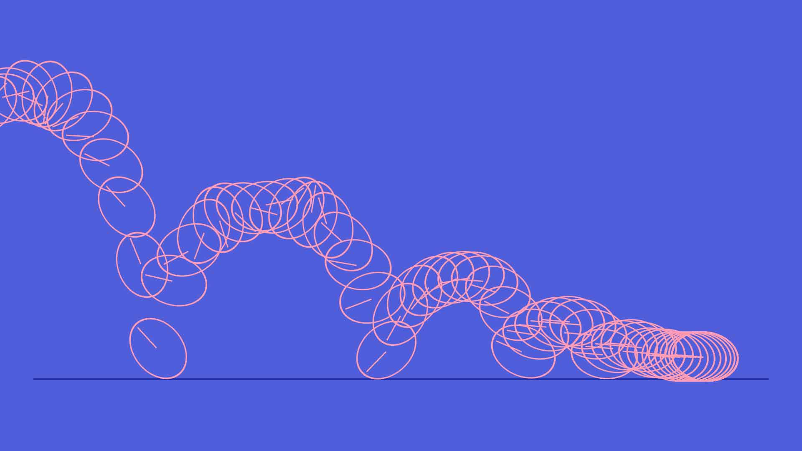
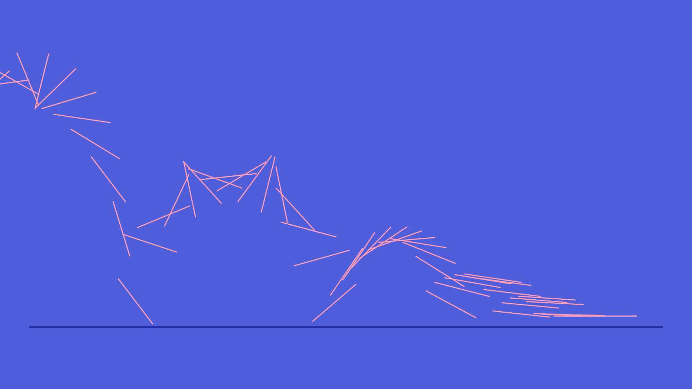

## Bouncing Ball
<div id="bouncing_ball" style="max-width:600px;"></div>


## With Squash and Stretch
<div id="bouncing_ball_squash_stretch" style="max-width:600px;"></div>


## Put Contact With Squash and Stretch
<div id="bouncing_ball_squash_stretch_b" style="max-width:600px;"></div>


## Soft Ball, Less Squash
<div id="ball_soft_less_squash" style="max-width:600px;"></div>



## Heavy Bowling Ball
<div id="ball_heavy_bowling" style="max-width:600px;"></div>


## Bouncing Bubble
<div id="bubble" style="max-width:600px;"></div>


## Bouncing Expression
<div id="expression" style="max-width:600px;"></div>
```
e = .6; //elasticity
g = 4000; //gravity
nMax = 9; //number of bounces allowed

n = 0;
if (numKeys > 0){
  n = nearestKey(time).index;
  if (key(n).time > time) n--;
}
if (n > 0){
  t = time - key(n).time;
  v = -velocityAtTime(key(n).time - .001)*e;
  vl = length(v);
  if (value instanceof Array){
    vu = (vl > 0) ? normalize(v) : [0,0,0];
  }else{
    vu = (v < 0) ? -1 : 1;
  }
  tCur = 0;
  segDur = 2*vl/g;
  tNext = segDur;
  nb = 1; // number of bounces
  while (tNext < t && nb <= nMax){
    vl *= e;
    segDur *= e;
    tCur = tNext;
    tNext += segDur;
    nb++
  }
  if(nb <= nMax){
    delta = t - tCur;
    value +  vu*delta*(vl - g*delta/2);
  }else{
    value
  }
}else
  value
```

## Bouncing Ball Rotate
<div id="bouncing_ball_rotate" style="max-width:600px;"></div>


## Bouncing Rod
<div id="bouncing_rod" style="max-width:600px;"></div>


<script>
  var bouncing_ball = bodymovin.loadAnimation({
    container: document.getElementById('bouncing_ball'),
    renderer: 'svg',
    loop: true,
    autoplay: true,
    path: '../lottie/03_ball.json'
  });
  var bouncing_ball_rotate = bodymovin.loadAnimation({
    container: document.getElementById('bouncing_ball_rotate'),
    renderer: 'svg',
    loop: true,
    autoplay: true,
    path: '../lottie/03_ball_rotate.json'
  });
  var bouncing_rod = bodymovin.loadAnimation({
    container: document.getElementById('bouncing_rod'),
    renderer: 'svg',
    loop: true,
    autoplay: true,
    path: '../lottie/03_bouncing_rod.json'
  });
  var bouncing_ball_squash_stretch = bodymovin.loadAnimation({
    container: document.getElementById('bouncing_ball_squash_stretch'),
    renderer: 'svg',
    loop: true,
    autoplay: true,
    path: '../lottie/03_ball_squash_stretch.json'
  });
  var bouncing_ball_squash_stretch_b = bodymovin.loadAnimation({
    container: document.getElementById('bouncing_ball_squash_stretch_b'),
    renderer: 'svg',
    loop: true,
    autoplay: true,
    path: '../lottie/03_ball_squash_stretch_b.json'
  });
  var ball_soft_less_squash = bodymovin.loadAnimation({
    container: document.getElementById('ball_soft_less_squash'),
    renderer: 'svg',
    loop: true,
    autoplay: true,
    path: '../lottie/03_ball_soft_less_squash.json'
  });
  var ball_heavy_bowling = bodymovin.loadAnimation({
    container: document.getElementById('ball_heavy_bowling'),
    renderer: 'svg',
    loop: true,
    autoplay: true,
    path: '../lottie/03_ball_heavy_bowling.json'
  });
  var bubble = bodymovin.loadAnimation({
    container: document.getElementById('bubble'),
    renderer: 'svg',
    loop: true,
    autoplay: true,
    path: '../lottie/03_bubble.json'
  });
  var expression = bodymovin.loadAnimation({
    container: document.getElementById('expression'),
    renderer: 'svg',
    loop: true,
    autoplay: true,
    path: '../lottie/03_expression.json'
  });
</script>
